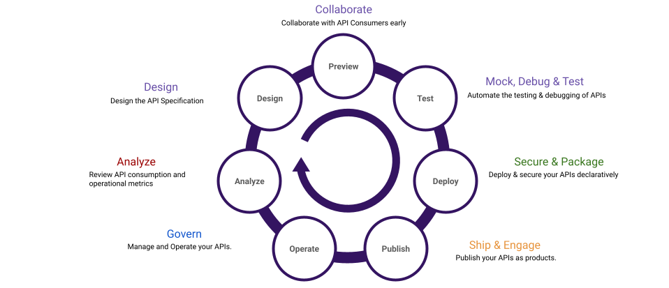
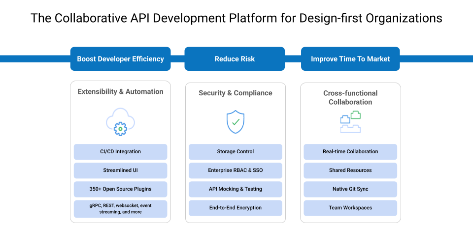
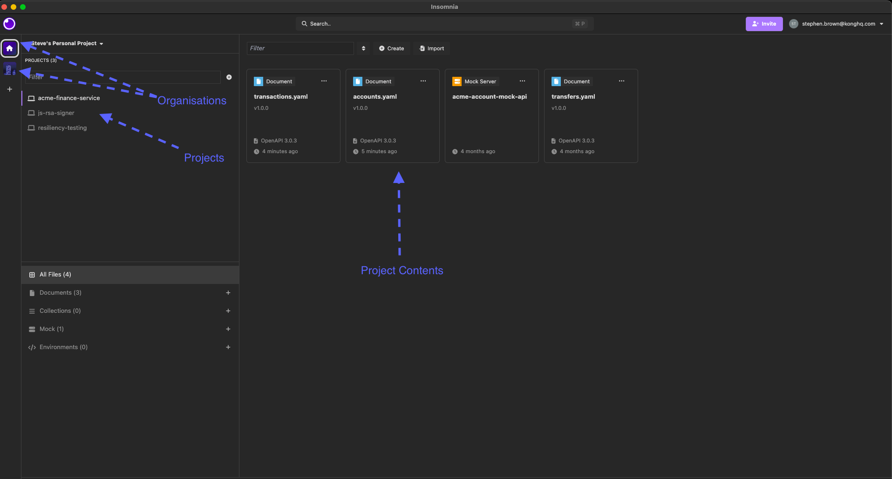
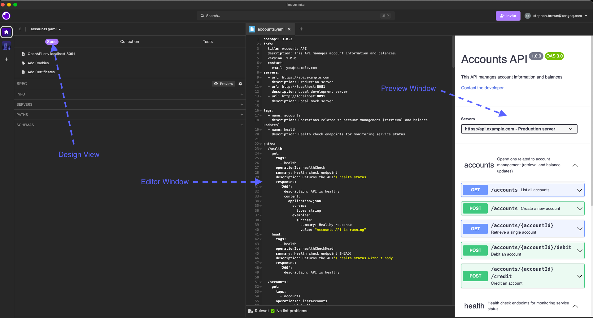

Insomnia is a collaborative **integrated development environment (IDE)** designed specifically for modern API workflows. It enables fast, iterative production of well-defined and consumable APIs.

With Insomnia, you can design, debug, test, and document your API — all from a single interface. Whether you're working solo or across a team, Insomnia helps accelerate development while ensuring your APIs are robust and production-ready.

## What Insomnia Offers

Insomnia provides a user-friendly interface that allows developers to:

- **Create and edit `OpenAPI` specifications**
- **Send requests to `REST`, `SOAP`, `GraphQL`, and `gRPC` APIs**
- **Inspect live responses**
- **Write complex test suites** for manual or automated testing
- **Work across multiple environments**, including local, test, staging, and production
- **Automate workflows** with a powerful CLI (`Inso CLI`)



## Insomnia Supports 3 Vital Stages of API Development

1. **Design**
   - Build your API specification with linting and instant feedback.
   - Visual editing of `OpenAPI` specs via the spec editor.
  
2. **Debug**
   - Send test requests and inspect responses.
   - Supports `REST`, `SOAP`, `gRPC`, and `GraphQL`.
   - No need for separate tooling.

3. **Test**
   - Write test suites based on your collection of requests.
   - Automate those tests in `CI/CD` pipelines using the `Inso CLI`.


## Insomnia Accelerates Deployment

Insomnia helps speed up the deployment process by converting `OpenAPI` specs directly into:

- Kubernetes Custom Resource Definitions (CRDs)
- Kong Gateway declarative configuration files

This means your design can go straight from spec to runtime with minimal friction.


## Two Tools: Desktop App + `Inso CLI`

Insomnia comes in two forms:

- **Desktop App**: A powerful GUI interface for designing and debugging APIs.
- **`Inso CLI`**: A command-line interface used to automate tasks as part of your `CI/CD` or `APIOps` pipeline.

In this workshop, we will cover both.

### Installation

Install both tools from your organisation's software centre or from the official download pages:

- Desktop: [https://insomnia.rest/download](https://insomnia.rest/download)
- `Inso CLI`: [https://docs.insomnia.rest/inso-cli/introduction](https://docs.insomnia.rest/inso-cli/introduction)

## Getting Started with Insomnia

While Insomnia can be used in local or scratchpad mode, we recommend creating an account and logging in to access the full suite of features:

### Key Benefits of Logging In

- Manage and switch between multiple projects
- Enable Git Sync for collaborative workflows
- Secure access with **SSO (OIDC/SAML)** for enterprise users
- Gain access to advanced enterprise features

## Enterprise Features Overview

Enterprise customers have access to additional powerful features:

- **Organisations**: Group related projects and teams
- **Git Sync**: Full version control and team collaboration
- **`RBAC`**: Role-based access control
- **Custom Spectral Linting**
- **Mocking** (Cloud & Self-hosted)
- **Secrets Management** via:
  - HashiCorp Vault (HCV)
  - AWS Secrets Manager
  - Azure Key Vault
  - GCP Secret Manager



## Insomnia Layout: IDE Structure

When logged in, the left panel shows the **organisation** you belong to. In this workshop, we will use the `Kong CX` organisation.

To the right, you can switch between the three main views in Insomnia:



| View        | Purpose |
|-------------|---------|
| **Spec**    | Edit and validate your `OpenAPI` spec |
| **Collections** | Create requests for debugging and testing |
| **Tests**   | Build and run test suites against your API |

### Spec Tab

Here you can:

- Create or paste in `OpenAPI` specifications
- Use Spectral-based linting to catch errors
- `Customise` the ruleset (we'll cover this in a later module)



### Collections Tab

This is where you:

- Create requests to test your API endpoints
- Add scripting logic (pre-request and post-response)
- Easily work across different environments (e.g., local vs production)

### Tests Tab

Here you:

- Build reusable test suites based on your collection
- Write assertions against responses
- Run tests manually or using the `Inso CLI` in your `CI/CD` pipeline

## Insomnia Environments

In Insomnia, **environments** are a powerful feature designed to make your API workflows more flexible, portable, and manageable.

Rather than hard-coding server addresses, tokens, or API keys into individual requests, Insomnia allows you to define variables once at the environment level and reference them dynamically across your collections, tests, and specs.

### Why Environments Matter

| Problem | How Environments Solve It |
|---------|----------------------------|
| Switching between dev, staging, and prod servers is manual and error-prone | Quickly swap environments with a dropdown |
| Secrets like tokens or credentials might get copied into requests accidentally | Securely store sensitive values separately |
| Collaboration becomes messy when people point to different servers or databases | Share consistent environment templates across teams |

### Types of Environments in Insomnia

- **Base Environment**:
  The global environment configuration for a project. Acts as a parent for all other environments.
- **Sub-Environments**:
  Specific environment configurations for different stages (e.g., `local-dev`, `staging`, `production`). These inherit from the Base Environment.
- **Private vs Shared Environments**:
  - **Shared environments** are synced via Git and visible to team members.
  - **Private environments** (used mainly for local secrets) are local-only and not shared.

### How Environments Are Used

- Defining API base URLs (e.g., `{{ base_url }}`)
- Setting authentication tokens dynamically
- Managing different sets of credentials
- Parameterise things like region, version numbers, customer IDs, or user roles

Example of a simple environment:

```json
{
  "base_url": "http://localhost:8081",
  "api_key": "super-secret-key"
}
```

And then in your request:

```yaml
GET {{ base_url }}/accounts
Authorization: Bearer {{ api_key }}
```

### Automatic Environment Generation from `OpenAPI` Specs

When you import or build a design document in Insomnia that includes a servers block, Insomnia will automatically generate a collection environment based on the first server URL.

For example, from a spec:

```yaml
servers:
  - url: http://localhost:8081
    description: Local development server
```

Insomnia creates an environment like:

```json
{
  "scheme": "http",
  "host": "localhost:8081",
  "base_path": ""
}
```

You can then rename it to something meaningful like `local-dev`, and clean it up (for example, deleting any unused fields like `base_path`).

**Best Practice:** Always customise and rename your generated environments to match your project structure.

### Working with Multiple Environments

Once you have multiple environments defined (e.g., `local-dev`, `staging`, `production`), you can easily switch between them using the dropdown in the top left of the Insomnia UI.

This changes the values dynamically across all requests and tests without you needing to manually edit URLs or tokens.

### Security Considerations

- Sensitive values like API keys, client secrets, or passwords should be placed in private environments or retrieved from external vaults (covered later in the Secrets Management module).
- Avoid committing sensitive data accidentally by using secret types or local environments.

### Summary

Using environments properly in Insomnia enables:

- Fast, reliable switching between different stages of your API
- Secure management of credentials and configuration
- Cleaner, reusable requests and test suites
- Better team collaboration on shared projects

## Next Module: Begin API Design

In the next module, we will create an Insomnia project for the `accounts-service` of Kong-Bank, then over the next few modules we will create and iterate upon a `OpenAPI` specification create collections, mocks, custom linting, and test suites within this Git-backed project.

Continue to: `Module 1: Project Setup and Git Integration`
