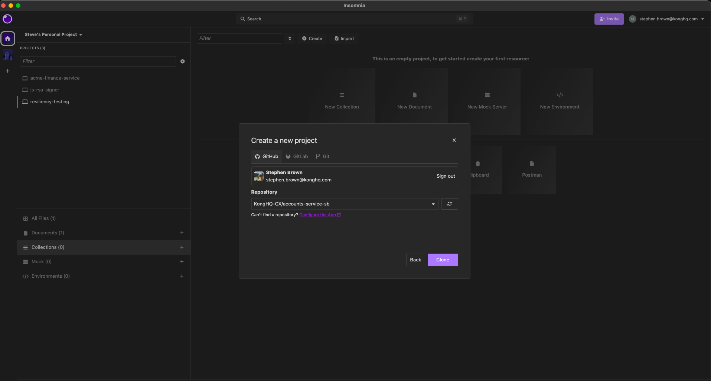
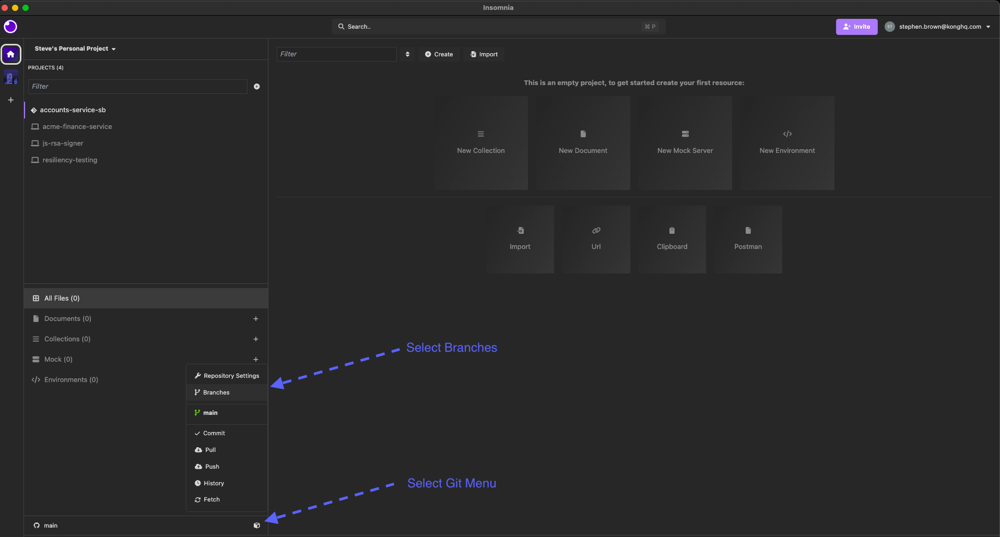
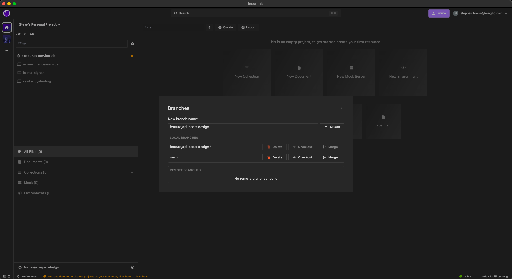

Welcome to the Insomnia Workshop.

In this course, we will work through the design, testing, and automation of an `OpenAPI` specification using `Insomnia` and the `Inso CLI`. All work will be managed via Git from the start, following best practice for collaborative API development.

This first module focuses on setting up your project using Git integration with Insomnia v11.

## About This Workshop

You will be working with a Git-backed API specification project for the `kong-bank` Accounts API. The template repository for this service is hosted on your organisation's GitHub Enterprise instance and will be referenced throughout this workshop as:

`https://github.com/konghq-cx/accounts-service.git`

> Note: `https://github.com/konghq-cx` is the address for the public version of this repository, if your company uses an enterprise git offering then this address will be updated in the course notes.

This repository contains:

- A ready-made implementation of the accounts service, written in Python.
- A docker-compose.yaml file for launching a local version of the service

You will build up a specification and its associated tests for the `accounts-service` throughout the course.

## Before You Begin

Ensure you have the following installed:

- Insomnia v11
- docker and docker-compose
- Access to your company's GitHub Enterprise

## Step 1: Create Your Repository from the Template

First, locate the template repository at:

`https://github.com/konghq-cx/accounts-service.git`

> Note: `https://github.com/konghq-cx` is the address for the public version of this repository, if your company uses an enterprise git offering then this address will be updated in the course notes.

Create your own repository from this template by:

1. Navigate to the template repository in your browser
2. Click on "Use this template" or "Generate from template" (the exact wording may vary based on your GitHub Enterprise setup)
3. Name your new repository following the convention of adding your initials to the end:

```bash
accounts-service-<your-initials>
```

   For example: `accounts-service-sb` if your initials are SB
4. Complete the repository creation process

Now clone your new repository locally:

```bash
git clone https://github.com/konghq-cx/accounts-service-<your-initials>.git
```

```bash
cd accounts-service-<your-initials>
```

> Note: `https://github.com/konghq-cx` is the address for the public version of this repository, if your company uses an enterprise git offering then this address will be updated in the course notes.

### Docker Compose Configuration

Inside this repo, you will find a `docker-compose.yaml` file. This file can be used to start and stop the `accounts-service` implementation.

While Kong typically recommends a **specification-first** approach to API development, the goal of this workshop is to focus on exploring and understanding the features of **Insomnia**. For that reason, having a working API implementation allows us to more effectively demonstrate those features in action. This `docker-compose` file exposes a working implementation of the `accounts-service` locally.

The service is started using a Docker Compose file, which looks like the following:

```yaml
services:
  accounts-service:
    image: kongcx/accounts-service:latest
    container_name: accounts
    ports:
      - "8081:8081"
    restart: unless-stopped
    environment:
      - LOG_LEVEL=info
```

As shown, this configuration is simple — it runs the container image and exposes the service on port 8081.

Please start the service locally:

```bash
docker compose up -d
```

Images are hosted in your internal container registry. If you are properly authenticated, the image should pull successfully.

## Step 2: Open Insomnia and Sign In

1. Open Insomnia v11.
2. Sign in using your company email address.
3. You will be redirected to your company's IDP for SSO (OIDC).
4. Once authenticated, Insomnia will redirect you back to the application.

## Step 3: Add a Git-Backed Project

Insomnia Git projects require an existing remote repository.

To add the accounts-service as a Git-backed project:

1. Click the + (plus) button in the Projects panel.
2. Choose "Git-Sync".
3. Set name for the project e.g. `accounts-service-<your-initials>`
4. Click next

5. Select the repository from the dropdown when it appears.
   - If the repository does not appear you may need to authorise Insomnia to you GitHub organisation
   - If this happens you can click on the `Can't find a repository? Configure the App` link, which will take you off to GitHub to authorise Insomnia

6. You will see a message indicating that no existing Insomnia files were found:

> This is expected as we have not yet added an Insomnia metadata to this project.
> We will create these the next few modules as we create our `OpenAPI` specification, collections and tests.


### How Insomnia Handles Project Metadata (v11)

In Insomnia v11, metadata such as collections, test scripts, environments, and design documents are no longer stored in a separate `.insomnia` directory.

Instead:

- All metadata is embedded directly into your `OpenAPI` spec file.
- This simplifies syncing and collaboration using Git.
- Insomnia recognises the spec via OAS annotations and internal metadata blocks.

## Step 4: Working with Git in Insomnia

With Git Sync configured, Insomnia provides powerful Git integration features directly within the interface. These tools allow teams to collaborate on shared API projects while maintaining clean version control and visibility into changes.

### Git Operations Menu

Use the **Git Sync** menu (found in the left-hand sidebar) to:


- View commit history
- Create and switch between branches
- Pull updates from collaborators
- Commit and push your own changes

### Managing Branches

Maintaining good Git hygiene is essential when working in a collaborative environment. You should:

- Use **feature branches** to isolate your work
- Create **pull requests** to support code review and approvals

From the Git menu, you can:

- Create new branches locally
- Switch between local and remote branches  
  > *Note: Remote branches will only appear after they've been pushed or fetched at least once.*


### Committing and Pushing Changes

To commit:

1. Click the **Git** dropdown and select **Commit**
2. Inspect the diffs of any proposed changes
3. Stage any changes you want to commit
4. Enter a meaningful, descriptive commit message

To push:

1. Click **Push** in the same Git menu
2. On first push, Insomnia will initialise metadata in the spec file


### Pulling Changes from Collaborators

When teammates push updates to the shared repo, you can stay in sync by:

1. Opening the Git Sync menu
2. Selecting **Pull**

This will merge their changes into your local project.

### Disconnect from Git (if needed)

To sign out of your Git account:

1. Go to **Setup Git Sync**
2. Open **Repository Settings**
3. Click **Sign Out** next to your listed Git account

### Additional Project Options

#### Rename Your Project (Local Only)

1. Open **Project Settings**
2. Update the name and click **Save**

> Note: The project name is stored locally and is not synced to Git.

#### Delete a Git-Backed Project

To delete a project from Insomnia:

1. From the project list, open **Project Settings**
2. Click **Delete Project**
3. Confirm deletion  
   > **Warning:** This removes the project from Insomnia but **does not** delete the remote Git repository.

### Prepare a Feature Branch for Module 02

Now that your Git project is connected, we are ready to set up good Git practices for the rest of the workshop.

Before starting **Module 02**, create a new Git branch that will hold all your work for that module.

> **Why?**
> In real-world API development, it's common to work in isolated feature branches for each change or improvement.
> In this workshop, we will mirror that practice:
>
> - Each module will have its own branch
> - This keeps changes clean, isolated, and easy to manage
> - It prepares you for collaborating through pull requests or merge reviews

You only need to do this once at the end of Module 01 — each later module will remind you when it's time to create a new branch.

#### Suggested branch name

```text
feature/api-spec-design
```

To create it:

1. Open the Git Sync menu

2. Click **Branches**
3. Type the branch name and click **Create**

4. Insomnia will automatically switch to the new branch

You'll now be ready to begin designing and testing the API in the next module.

## Summary

You have now:

- Cloned and run the accounts-service locally
- Set up a Git-synced project in Insomnia
- Learned how metadata is stored in Insomnia v11
- Explored Git operations and branch management inside the Insomnia app

You are now ready to begin working on the API specification itself.

Next: `Module 2: Designing an API Spec`
