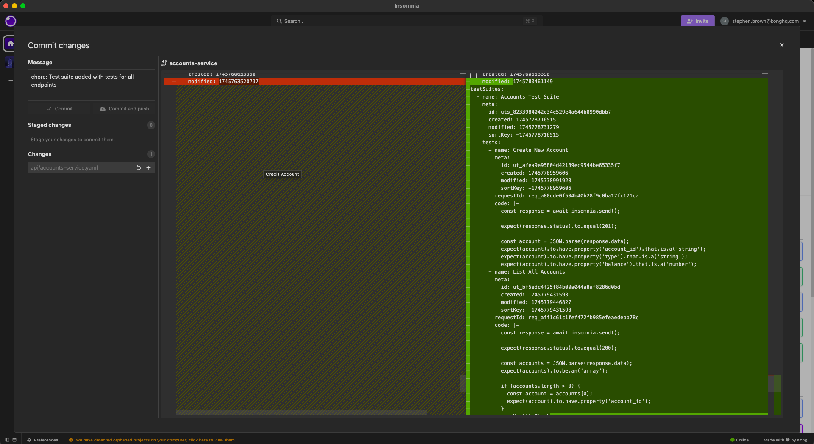
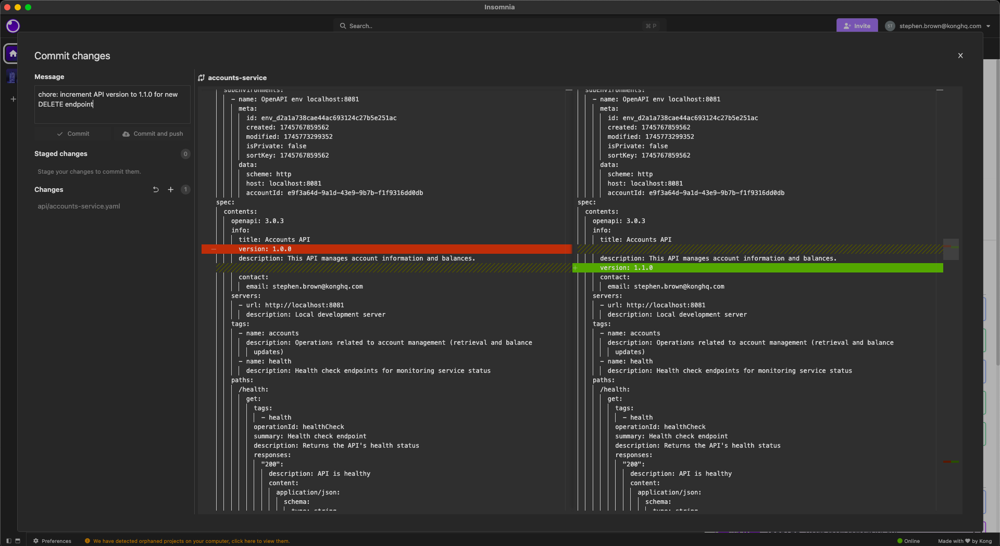
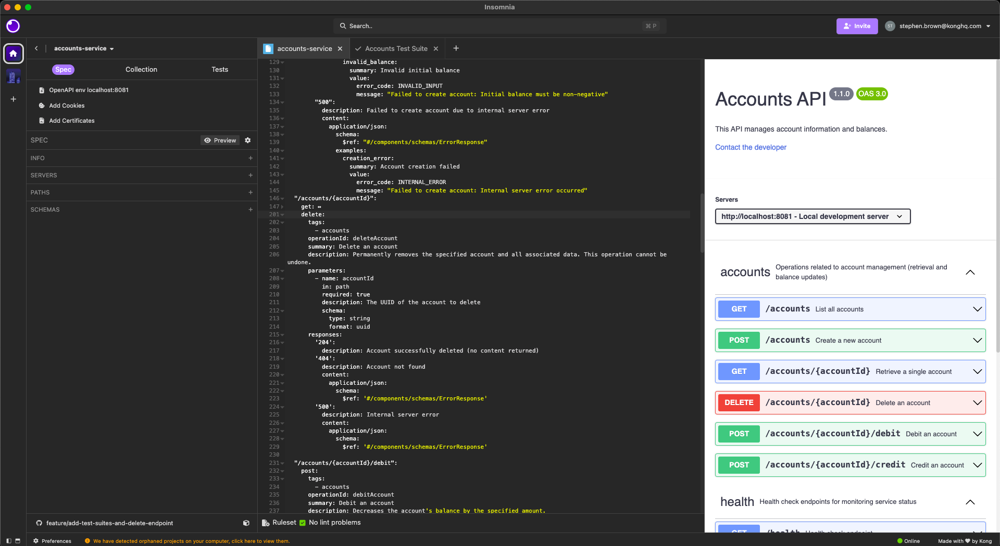
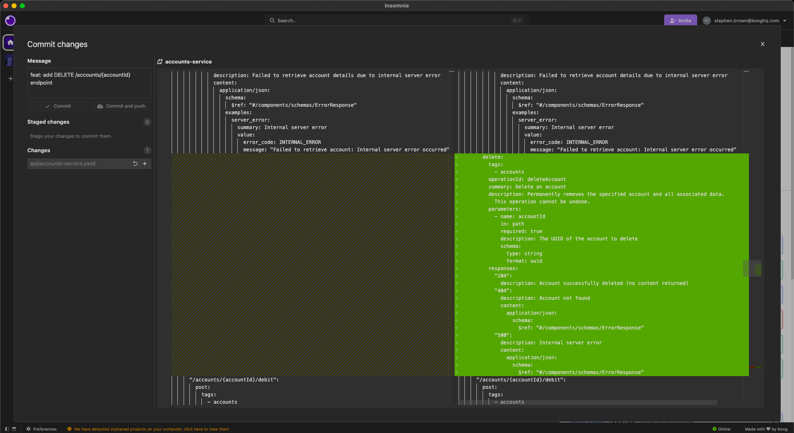
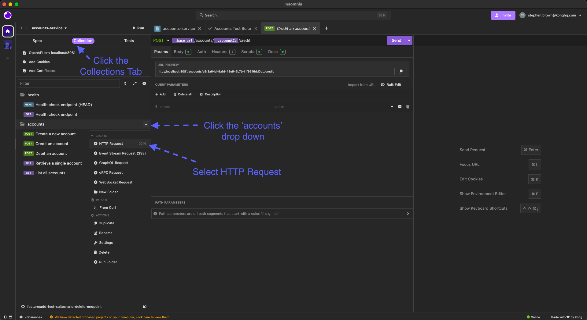
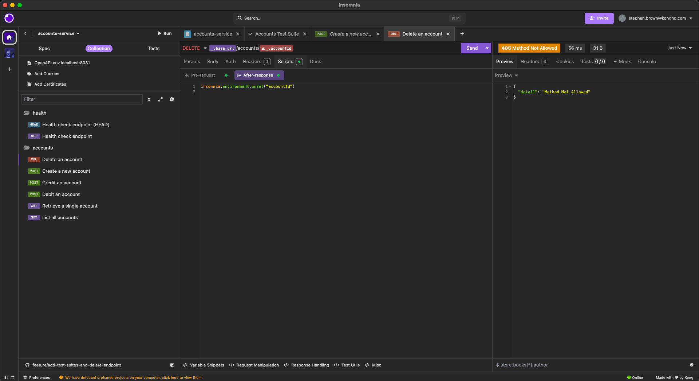
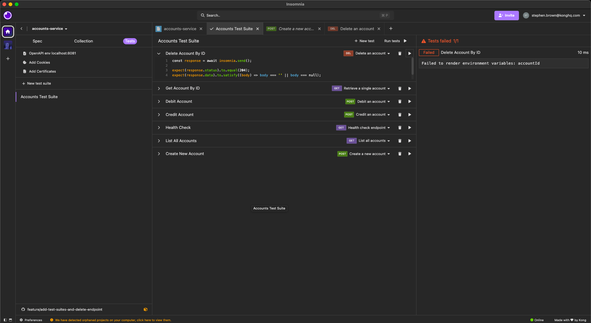
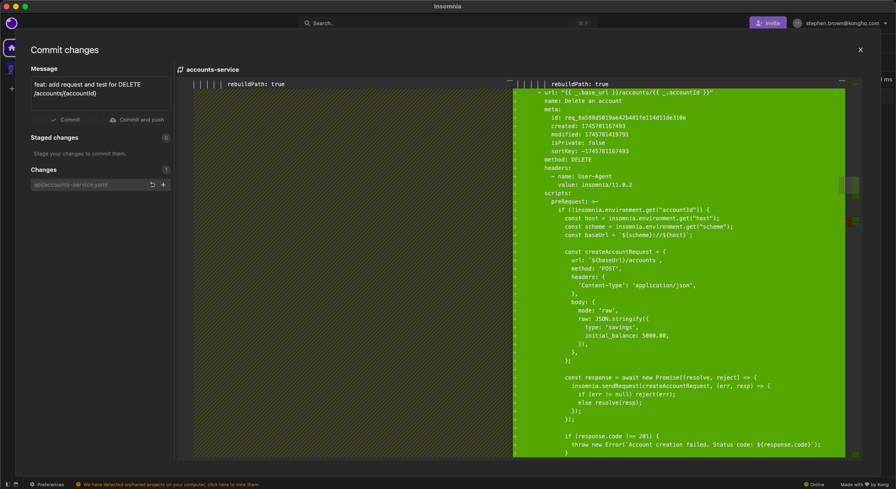

In this module, we move beyond scripting and focus on structured, reusable **Test Suites** in Insomnia, while also extending our specification with a new DELETE operation.

With your API specification complete and your collections generated, it's time to ensure everything works reliably, not just manually, but automatically.

In this module, you will:

- Understand how Test Suites improve API quality
- Create automated tests linked to your requests
- Extend the API by adding a DELETE operation
- Practice versioning and proper Git commit hygiene
- Commit and push your testing and spec changes

## Prerequisites

If you are starting the course from this module and have not completed the previous steps, you can import the Insomnia metadata to bring you up to date.

<details>
<summary><strong>Expand to see how to import the required metadata</strong></summary>

1. Clone the `insomnia-workshop-exports` repository:

   ```bash
   git clone https://your-github-enterprise-url/konghq-cx/insomnia-workshop-exports.git
   ```

   Or, internally inside Kong:

   ```bash
   git clone https://github.com/KongHQ-CX/insomnia-workshop-exports.git
   ```

2. Locate and import the correct "end state" YAML file from the previous module.
   - For example, for starting Module 4, import `accounts-service/module-03/api-spec/module-03-end-state.yaml`.

> **Note:** Some modules include both `api-spec` and `mock-spec`. Always import both if available.

</details>

This ensures you are starting the module with the correct project state.

## Step 1: Create a Feature Branch

Before we start creating tests and making spec changes:

1. In Insomnia, click on the branch name in the Git panel.
2. Create a new branch named: `feature/add-test-suites-and-delete-endpoint`
3. Click **Create** to switch to the new branch.


## Step 2: Create a Test Suite

1. In the **Tests** tab, click **New test suite**.
2. Name it: `Accounts API Test Suite`


This will serve as the container for all your tests.

## Step 3: Write Tests for Core API Endpoints

We'll now create basic functional tests for key endpoints.

Click the `New test` button to add each test case

### Test: Create New Account

- Assign to: **Create a new account** request
- Test script:

```javascript
const response = await insomnia.send();

expect(response.status).to.equal(201);

const account = JSON.parse(response.data);
expect(account).to.have.property('account_id').that.is.a('string');
expect(account).to.have.property('type').that.is.a('string');
expect(account).to.have.property('balance').that.is.a('number');
```


#### Description of the Insomnia Test

This Insomnia test script performs the following actions:

1. **Send the Request**:
   - It sends the current request and waits for the response.

2. **Verify the HTTP Status Code**:
   - It asserts that the response status code is `201`, indicating successful resource creation.

3. **Parse and Validate the Response Body**:
   - It parses the response body from JSON format.
   - It asserts that the parsed object includes the following properties:
     - `account_id`, which must be a string.
     - `type`, which must be a string.
     - `balance`, which must be a number.

This ensures that the API response has the expected structure and data types after creating a new account.

### Test: List All Accounts

- Assign to: **List all accounts** request
- Test script:

```javascript
const response = await insomnia.send();

expect(response.status).to.equal(200);

const accounts = JSON.parse(response.data);
expect(accounts).to.be.an('array');

if (accounts.length > 0) {
  const account = accounts[0];
  expect(account).to.have.property('account_id');
}
```


#### Description of the List All Accounts Insomnia Test

This Insomnia test script performs the following actions:

1. **Send the Request**:
   - It sends the current request and waits for the response.

2. **Verify the HTTP Status Code**:
   - It asserts that the response status code is `200`, indicating a successful retrieval.

3. **Parse and Validate the Response Body**:
   - It parses the response body from JSON format.
   - It asserts that the parsed response is an array.
   - If the array is not empty, it checks that the first object in the array has an `account_id` property.

This ensures that the API correctly returns a list of accounts and that each account object contains the expected `account_id` field.

### Test: Health Check

- Assign to: **Health check endpoint** request (GET)
- Test script:

```javascript
const response = await insomnia.send();

expect(response.status).to.equal(200);

const body = response.data;
expect(body).to.be.a('string');
expect(body.toLowerCase()).to.include('accounts api');
```


#### Description of the Insomnia Health Check Test

This Insomnia test script performs the following actions:

1. **Send the Request**:
   - It sends the current request and waits for the response.

2. **Verify the HTTP Status Code**:
   - It asserts that the response status code is `200`, confirming a successful operation.

3. **Parse and Validate the Response Body**:
   - It verifies that the response body is a string.
   - It checks that the string, when converted to lower case, includes the text `accounts api`.

This ensures that the API endpoint correctly returns a string containing the expected `accounts api` text.

### Test: Credit Account

- Assign to: **Credit an account** request
- Test script:

```javascript
const response = await insomnia.send();

expect(response.status).to.equal(200);

const account = JSON.parse(response.data);
expect(account).to.have.property('balance').that.is.a('number');
```


#### Description of the Insomnia Credit an Account Test

This Insomnia test script performs the following actions:

1. **Send the Request**:
   - It sends the current request and waits for the response.

2. **Verify the HTTP Status Code**:
   - It asserts that the response status code is `200`, indicating a successful retrieval.

3. **Parse and Validate the Response Body**:
   - It parses the response body as JSON.
   - It asserts that the parsed object has a `balance` property that is a number.

This ensures that the API correctly returns an account object with a numerical `balance` property.

### Test: Debit Account

- Assign to: **Debit an account** request
- Test script:

```javascript
const response = await insomnia.send();

expect(response.status).to.equal(200);

const account = JSON.parse(response.data);
expect(account).to.have.property('balance').that.is.a('number');
```


#### Description of the Insomnia Debit an Account Test

This Insomnia test script performs the following actions:

1. **Send the Request**:
   - It sends the current request and waits for the response.

2. **Verify the HTTP Status Code**:
   - It asserts that the response status code is `200`, indicating a successful retrieval.

3. **Parse and Validate the Response Body**:
   - It parses the response body as JSON.
   - It asserts that the parsed object has a `balance` property that is a number.

This ensures that the API correctly returns an account object with a numerical `balance` property.

### Test: Get Account By ID

- Assign to: **Retrieve a single account** request
- Test script:

```javascript
const response = await insomnia.send();

expect(response.status).to.equal(200);

const account = JSON.parse(response.data);
expect(account).to.have.property('account_id').that.is.a('string');
```


### Description of the Get Account by ID Insomnia Test

This Insomnia test script performs the following actions:

1. **Send the Request**:
   - It sends the current request and waits for the response.

2. **Verify the HTTP Status Code**:
   - It asserts that the response status code is `200`, indicating a successful retrieval.

3. **Parse and Validate the Response Body**:
   - It parses the response body as JSON.
   - It asserts that the parsed object has an `account_id` property that is a string.

This ensures that the API correctly returns an account object with a string `account_id` property.

### Run All the Tests and Push Changes

Once you have finished creating all the tests for the endpoints and if you have not already done so, make sure you run the tests and confirm they all pass.

Then commit and push your changes:

- Commit message: `chore: Test suite added with tests for all endpoints`
- Push your changes.



## Step 4: Extend the Specification with a DELETE Endpoint

Now let's extend the `accounts-service.yaml` spec by adding a `DELETE /accounts/{accountId}` operation.

### Increment the `OpenAPI` Version

Since this is a new feature, update the `info.version`:

```yaml
info:
  title: Accounts API
  description: This API manages account information and balances.
  version: 1.1.0  # Updated from 1.0.0, Add DELETE endpoint
  contact:
    email: stephen.brown@konghq.com
```

**Commit and Push:**

- Commit message: `chore: increment API version to 1.1.0 for new DELETE endpoint`
- Push your changes.



### Add the DELETE Operation

Extend the `/accounts/{accountId}` path:

```yaml
  /accounts/{accountId}:
    get:
      # Existing GET operation
    delete:
      tags:
        - accounts
      operationId: deleteAccount
      summary: Delete an account
      description: Permanently removes the specified account and all associated data. This operation cannot be undone.
      parameters:
        - name: accountId
          in: path
          required: true
          description: The UUID of the account to delete
          schema:
            type: string
            format: uuid
      responses:
        '204':
          description: Account successfully deleted (no content returned)
        '404':
          description: Account not found
          content:
            application/json:
              schema:
                $ref: '#/components/schemas/ErrorResponse'
        '500':
          description: Internal server error
          content:
            application/json:
              schema:
                $ref: '#/components/schemas/ErrorResponse'
```



**Commit and Push:**

- Commit message: `feat: add DELETE /accounts/{accountId} endpoint`
- Push your changes.



## Step 5: Manually Create a Delete Request and Test

Since this request did not exist during initial collection generation, manually add it now as this will give us experience of manually creating requests as well as auto generating them.

- In the `Collections` tab
- Create a new HTTP request named **Delete an account**.
   
- Path: `{{ _.base_url }}/accounts/{{ _.accountId }}`
- Method: `DELETE`
- Add a pre-request script copied from the `Credit an account` After-response script
- Add an after-response script to unset the `accountId`:

   ```javascript
   insomnia.environment.unset("accountId")
   ```

   

Note: This request will not work at the moment as the underlying implementation does not yet support the delete an account endpoint.

### Create a Test for DELETE

- Assign to: **Delete an account** request
- Test script:

```javascript
const response = await insomnia.send();

expect(response.status).to.equal(204);
expect(response.data).to.satisfy((body) => body === '' || body === null);
```



Note: This test will not pass at the moment as the underlying implementation does not yet support the delete an account endpoint.

**Commit and Push:**

- Commit message: `feat: add request and test for DELETE /accounts/{accountId}`
- Push your changes.



After committing and pushing:

- Create a pull request from your `feature/add-test-suites-and-delete-endpoint` branch into `main`.
- Once reviewed, merge your branch to keep the `main` branch up-to-date with your completed work.

## Step 6: Versioning Best Practices

When managing API specifications:

| Change Type | Version Change | Example |
|-------------|----------------|---------|
| Breaking change | Major (1.0.0 → 2.0.0) | Removing fields, changing behaviour |
| New features | Minor (1.0.0 → 1.1.0) | Adding endpoints, fields |
| Bug fixes | Patch (1.0.0 → 1.0.1) | Correcting typos, examples |

Maintaining clear versioning communicates the impact of changes to consumers.

## Summary

You have now:

- Created and structured a reusable Test Suite
- Extended the specification with a DELETE operation
- Practiced semantic versioning principles
- Manually created and tested a new request
- Committed and pushed your work properly

**Next:** `In Module 5: Custom Linting`, we will enforce API standards by adding custom Spectral linting rules, and deal with removing the DELETE operation to maintain compliance!
